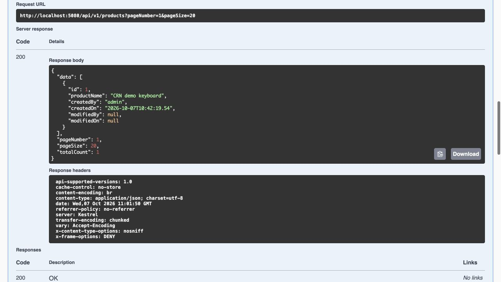

# CRN Products API

A .NET 8 Web API for managing Products and their related Items.

## Tech stack

ASP.NET Core, SQL Server, Entity Framework Core, FluentValidation, JWT authentication, Serilog, Swagger, Docker, and xUnit.

## Project structure

- **API**: controllers and middleware.
- **Application**: DTOs, validation, and services.
- **Domain**: entities.
- **Infrastructure**: database access and authentication.
- **Tests**: unit and integration tests.

## Run locally

Install Docker with Compose, then run from the project folder:

```sh
cp .env.example .env
```

Replace the placeholders in `.env` with your own secrets. Use passwords of at least 12 characters and a JWT key of at least 32 bytes.

```sh
docker compose up --build -d
```

Open [Swagger](http://localhost:5080/swagger).

To run the API without Docker, install the .NET 8 SDK and configure SQL Server. Set `ConnectionStrings:Database`, `Jwt:Key`, `Seed:AdminPassword`, `Seed:ReaderPassword`, and `Database:Initialize=true` through user secrets or environment variables, then run:

```sh
dotnet run --project src/API
```

Startup initialization applies the included EF migrations and creates the demo users.

## Using the API

1. Log in through `POST /api/v1/auth/login` using `admin` or `reader` and the password you configured.
2. Copy the access token into Swagger's **Authorize** box.
3. Use the Products and Items endpoints. Admin can create, update, and delete; Reader can view.

Product CRUD is available at `/api/v1/products`. Related Items use `/api/v1/products/{id}/items`. List endpoints support `pageNumber` and `pageSize`. Refresh and logout use `/api/v1/auth/refresh` and `/api/v1/auth/revoke`. Swagger documents all endpoints and request models.

## Tests

```sh
dotnet test CrnAssessment.sln
```

All 14 tests passed locally, and the GitHub build and test workflow passed. See [validation details](VALIDATION.md) for the verification scope, including Docker limitations.

The Compose setup is intended for local use. Deployment requires HTTPS, secure secret storage, and reviewed database migrations.

## Local screenshot


