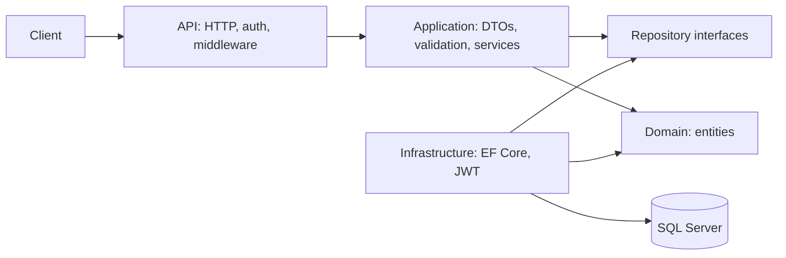

# CRN Products API

A focused .NET 8 assessment implementation: authenticated Product CRUD, related Items, SQL Server persistence, refresh token rotation, and tests. There is no frontend; Swagger is the interactive application interface.

## Architecture



- **API** translates HTTP requests, applies versioning/permissions, and returns consistent Problem Details errors.
- **Application** owns the product use cases, DTOs, validation, and persistence contracts.
- **Domain** contains Product, Item, User, and RefreshToken entities without dependencies.
- **Infrastructure** implements repository contracts with EF Core and authentication with JWT/password hashing.

EF Core's scoped DbContext is the unit of work. One `SaveChangesAsync` commits an operation atomically; there is no redundant generic repository or domain-event framework. Authentication implementation lives in Infrastructure behind `IAuthService`.

## Schema and decisions

`Product`: identity `Id`, `ProductName nvarchar(255)`, `CreatedBy nvarchar(100)`, `CreatedOn datetime`, nullable `ModifiedBy nvarchar(100)` and `ModifiedOn datetime`.

`Item`: identity `Id`, required indexed `ProductId` foreign key, `Quantity int`. A Product has many Items. Deleting a Product cascades to its Items. Quantity is nonnegative, enforced by validation and a SQL check constraint. Duplicate product names are allowed because the supplied schema does not require uniqueness. Audit values come from the authenticated identity and UTC server clock, never client input.

Additional User and RefreshToken tables support authentication. Passwords use ASP.NET Core PasswordHasher; refresh tokens are stored as SHA-256 hashes, with unique hash and family indexes and a SQL Server rowversion concurrency token.

## Prerequisites

- .NET 8 SDK (global.json selects 8.0.422 or a newer patch).
- SQL Server 2022, or Docker Desktop/Engine with Compose.
- Internet access for NuGet and container images.

SQL Server's container uses `linux/amd64`. On Apple Silicon it requires compatible emulation; if unavailable, use a remote SQL Server or a Windows/Linux x64 machine. SQLite is used only by integration tests, never by the production application.

## Quick start with Docker

```sh
cp .env.example .env
# Edit .env: replace every placeholder with your own strong secret.
docker compose up --build -d
docker compose logs -f api
```

Open **http://localhost:5080/swagger**. Compose waits for SQL readiness, applies the checked-in migrations, and creates `admin` and `reader` using the passwords in `.env`. Persistent SQL data lives in the `sql-data` volume. Changing seed password variables does not reset existing users' passwords. `docker compose down` keeps data; `docker compose down -v` permanently deletes it.

The Compose file is a local demonstration configuration: HTTP on loopback, Swagger enabled, database certificate trusted, automatic migrations/seeding. Do not use it unchanged for public hosting.

## Run without Docker

Configure an existing SQL Server. For example, from the repository root:

```sh
dotnet restore
dotnet user-secrets init --project src/API
dotnet user-secrets set 'ConnectionStrings:Database' 'Server=localhost,1433;Database=CrnAssessment;User Id=sa;Password=YOUR_PASSWORD;Encrypt=True;TrustServerCertificate=True' --project src/API
dotnet user-secrets set 'Jwt:Key' 'YOUR_RANDOM_KEY_OF_AT_LEAST_32_BYTES' --project src/API
dotnet user-secrets set 'Seed:AdminPassword' 'YOUR_STRONG_ADMIN_PASSWORD' --project src/API
dotnet user-secrets set 'Seed:ReaderPassword' 'YOUR_STRONG_READER_PASSWORD' --project src/API
dotnet user-secrets set 'Database:Initialize' 'true' --project src/API
dotnet run --project src/API
```

Use passwords of at least 12 characters. `Jwt:Issuer` and `Jwt:Audience` have defaults in appsettings.json. Secrets have no committed defaults. Alternatively use environment variables, e.g. `Jwt__Key`, `ConnectionStrings__Database`, `Seed__AdminPassword`.

For manually managed migrations:

```sh
dotnet tool restore
# The design-time factory reads this environment variable, not API user secrets:
export ConnectionStrings__Database='Server=localhost,1433;Database=CrnAssessment;User Id=sa;Password=YOUR_PASSWORD;Encrypt=True;TrustServerCertificate=True'
dotnet ef database update --project src/Infrastructure --startup-project src/API
# After changing a mapped entity:
dotnet ef migrations add DescribeChange --project src/Infrastructure --startup-project src/API --output-dir Data/Migrations
```

Startup migration/seeding is opt-in. Disable it after local initialization if preferred. Production should apply reviewed migration scripts through a deployment job.

## Authentication

1. `POST /api/v1/auth/login` with `{"username":"admin","password":"YOUR_PASSWORD"}`.
2. Receive `accessToken`, `refreshToken`, and `accessTokenExpiresAt`.
3. In Swagger click **Authorize**, paste only the access token, then call Products endpoints. Other clients send `Authorization: Bearer <accessToken>`.
4. Access tokens expire after 15 minutes (30 seconds validation clock skew). `POST /api/v1/auth/refresh` with `{"refreshToken":"..."}` replaces the refresh token and issues a new access token. Store the new pair; never reuse the old refresh token.
5. Refresh tokens expire after seven days. Reusing a revoked token revokes all active refresh tokens in that family. SQL rowversion detects simultaneous attempts to rotate the same token; EF saves revocation and replacement in one transaction.
6. `POST /api/v1/auth/revoke` with the refresh token logs out that refresh family. Already issued JWTs remain usable until expiry; JWT revocation is not immediate.

There is no public registration or client-selected role. Demo users are provisioned through explicit seed configuration. Login, refresh, and revoke are limited to ten requests per minute per client IP. A production deployment needs shared throttling and account lockout/identity-provider support. Treat refresh tokens as secrets; never include them in screenshots or logs.

## Endpoints

All resource routes use URL version `v1`. Products and Items require authentication; writes require **Admin**. **Reader** can read.

| Method | Path | Purpose / success |
|---|---|---|
| POST | `/api/v1/auth/login` | Login, 200 token pair |
| POST | `/api/v1/auth/refresh` | Rotate refresh token, 200 token pair |
| POST | `/api/v1/auth/revoke` | Revoke family, 204 |
| GET | `/api/v1/products?pageNumber=1&pageSize=20` | Paginated products, 200 |
| GET | `/api/v1/products/{id}` | Product detail, 200 |
| POST | `/api/v1/products` | Create, 201 + Location |
| PUT | `/api/v1/products/{id}` | Replace name, 204 |
| DELETE | `/api/v1/products/{id}` | Delete product and related items, 204 |
| GET | `/api/v1/products/{id}/items?pageNumber=1&pageSize=20` | Paginated related items, 200 |
| POST | `/api/v1/products/{id}/items` | Create item, 201 |
| PUT | `/api/v1/products/{id}/items/{itemId}` | Replace quantity, 204 |
| DELETE | `/api/v1/products/{id}/items/{itemId}` | Delete related item, 204 |
| GET | `/health` | Process liveness, 200 (does not probe SQL) |

Product write: `{"productName":"Keyboard"}`. Item write: `{"quantity":10}`.

Collections return `data`, `pageNumber`, `pageSize`, `totalCount`. Page size is 1–100, page number 1–1,000,000; ordering by Id makes paging deterministic. Large out-of-range pages return an empty data array. Negative/non-integer route IDs do not match routes (404).

Errors use `application/problem+json`: 400 validation/malformed JSON, 401 invalid/missing authentication, 403 insufficient role, 404 unknown resource, 409 database conflict, 429 throttled, 500 unexpected failure. Middleware-generated errors include `traceId`; FluentValidation errors include a property-keyed `errors` object. Unexpected details remain in server logs rather than the response.

## Performance and security

- Paginated list queries project only needed DTO columns and use AsNoTracking; detail reads also use AsNoTracking. Updates intentionally use tracked entities.
- All database work is asynchronous and accepts request cancellation. EF parameterizes queries.
- ProductId index supports related item queries; primary key ordering supports paging. Count/data queries are separate, so totals may change during concurrent writes.
- Response compression is registered for HTTP local responses. HTTPS compression stays disabled by default to reduce compression side-channel risk.
- CORS allows only configured origins (`Cors:Origins`, default localhost:3000). CORS controls browsers, not API authorization.
- `nosniff`, frame denial, no-referrer and no-store headers are applied. HSTS and HTTPS redirection are enabled outside Development/Testing.
- Structured Serilog request logs capture method/path/status/duration, not request bodies or token values. No secrets are committed.
- Product updates use last-write-wins; optimistic concurrency is implemented specifically for refresh rotation. This is an explicit assessment tradeoff.

## Tests

```sh
dotnet test CrnAssessment.sln
```

xUnit/Moq tests exercise service validation and audit behavior. WebApplicationFactory tests exercise real middleware, JWT verification, role restrictions, Product/Item CRUD, pagination, malformed JSON, cascade delete, and refresh replay/logout using a relational SQLite in-memory database. SQLite tests override rowversion generation only for compatibility; they do not prove SQL Server rowversion behavior, migration execution, SQL Server datetime semantics, or simultaneous refresh requests. Those require SQL Server verification.

See [VALIDATION.md](VALIDATION.md) for recorded test results and verification scope.

## Deployment notes

Build the multi-stage Dockerfile; the runtime runs as the unprivileged `app` user. Use a secrets manager for signing key, DB credentials, and provisioning credentials. Use a dedicated SQL account with minimum permissions, managed backups, and a valid server certificate (`TrustServerCertificate=False`).

Apply migrations once in CI/deployment, keep `Database__Initialize=false`, and provision users through an administrative workflow. Host behind a reverse proxy terminating HTTPS with TLS 1.2 or newer, or configure Kestrel with a valid HTTPS certificate/port. When using a proxy, configure trusted forwarded headers and proxy addresses before HTTPS redirection and IP throttling; do not blindly trust client-provided headers. Add database readiness checks and centralized log collection. Swagger remains disabled outside Development. Rotate keys through a planned process; this sample has one signing key rather than a key ring.

## Local demonstration

The following screenshot shows a SQL Server-backed `GET /api/v1/products` request returning HTTP 200 with a saved product.


## Validation scope

The solution was compiled and all 14 automated tests passed. Additional local checks used SQL Server for migrations, Product/Item creation, pagination, and refresh token rotation/replay. See [VALIDATION.md](VALIDATION.md) for details.

The API was run with the .NET runtime against a containerized SQL Server. The complete API Docker image and Compose stack have not been verified. Product edits use last-write-wins; existing access tokens remain valid until expiry after refresh-family revocation.
